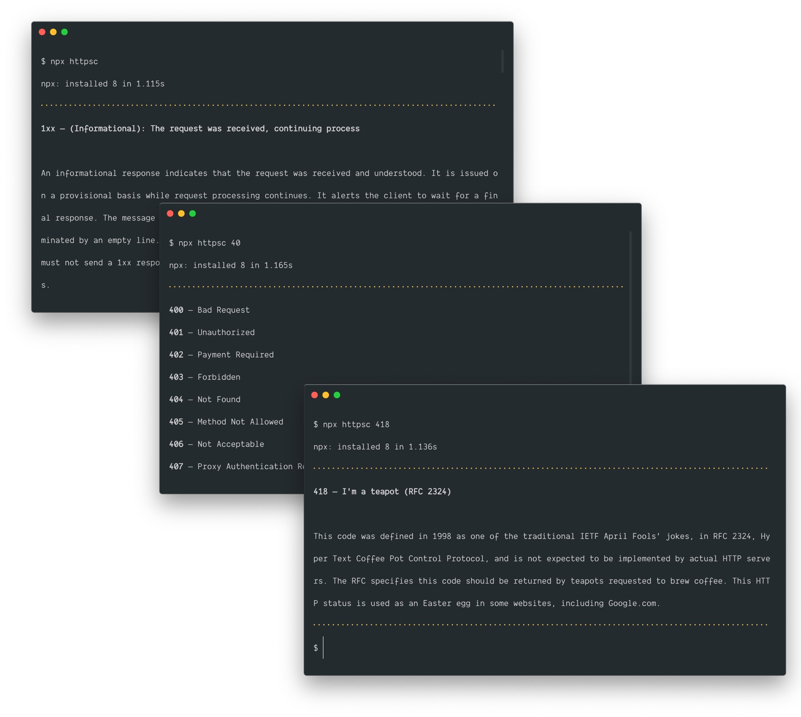

# httpsc


Simple HTTP status codes reference CLI. The `httpsc` command stands for "HTTP status codes". Sorry, more meaningful package names are taken.



## Usage

Use a pattern matching to get short info about multiple codes or detailed info about particular one.

- `npx httpsc` to get the whole reference
- `npx httpsc 4` to get short info about all `4xx` codes
- `npx httpsc 40` to get short info about all `40x` codes
- `npx httpsc 404` to get detailed info about `404` code

### Node.js API

Do you wan't to use this info on your project? Here you go.

```
yarn add httpsc
```

```js
import httpsc, { getCode } from "httpsc";
```

- `httpsc` to get the whole reference
- `getCode` to get the info about particular status code (i.e. `getCode(404)`)

## Thanks to

[Wikipedia](https://en.wikipedia.org/wiki/List_of_HTTP_status_codes) :-*
